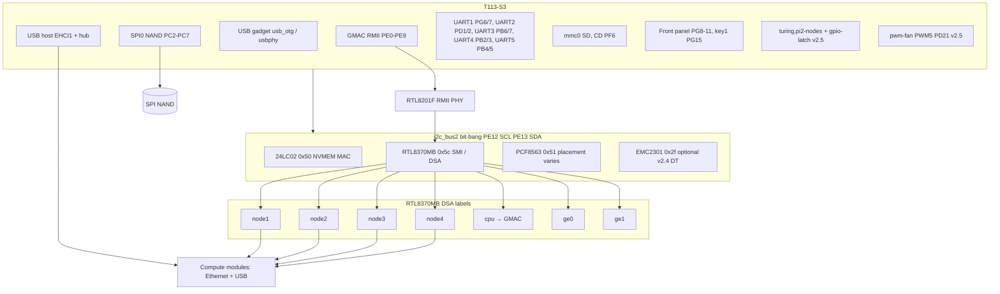

# Official Turing Pi BMC firmware


The Turing Pi is a compact AI & edge computing cluster purposed to run cloud
stacks and AI inference at the edge. Find out more on our
[website](https://turingpi.com).

The firmware is based on a **Linux** kernel (version pinned in [this table](#versions-defined-in-this-repository)) and hosts a web interface with a
REST API to control and manage the board. The packages
[bmcd](https://www.github.com/turing-machines/bmcd),
[tpi](https://github.com/turing-machines/tpi) and
[bmc-ui](https://github.com/turing-machines/BMC-UI) are part of the firmware and
facilitate most of this functionality.

## Table of Contents

- [Table of Contents](#table-of-contents)
- [Reporting issues \& requesting features](#reporting-issues--requesting-features)
- [BMC chip specs](#bmc-chip-specs)
- [Install firmware](#install-firmware)
- [Build / Development](#build--development)
- [Quickstart](#quickstart)
- [Start DevContainer](#start-devcontainer)
- [macOS / Darwin](#macos--darwin)
  - [macOS / Darwin Build Performance](#macos--darwin-build-performance)
- [Windows](#windows)
  - [Build Performance](#build-performance)
- [Scripts](#scripts)
- [Commands](#commands)
- [Building](#building)
  - [Linux / Windows](#linux--windows)
  - [OSX](#osx)
  - [Manual](#manual)
  - [Native](#native)
- [Output](#output)
- [Development](#development)
  - [BMC hardware overview](#bmc-hardware-overview)
  - [BMC rootfs software inventory](#bmc-rootfs-software-inventory)

## Reporting issues & requesting features

It is recommended to use the issue tracker of the current BMC-Firmware repository
to request features or submit bug reports. We are open to all feedback and
improvements. We scan the dependent repositories regularly for activity, but for
visibility reasons, we will mainly use the issue tracker of this repository.

## BMC chip specs

- CPU Allwinner T113-S3 (ARM Cortex-A7)
- 128 MB DDR3 RAM
- SPI NAND flash — **128 MB** (Macronix MX35LF1GE4AB) on V2.3 / V2.4 boards; **256 MB** (Macronix MX35LF2GE4AD) on V2.5.2 boards
- EEPROM (24C02C)
- 3 port Gigabit Ethernet Switch (RTL8370MB)
- Ethernet PHYceiver (RTL8201F-VB-CG)
- SD card slot

## Install firmware

>**Note: If you are running a firmware version lower than < v2.0.0, you must do
>a one-time-only SD card upgrade to version v2.0.0.**
>
>**Note 2: Prior to v2.0.0 a third-party tool 'PhoenixSuit' was required to
>flash firmware. This tool is obsoleted, and only the methods described on our
>website can be used to flash your board.**

The latest firmware images can be found on the [release page](https://github.com/turing-machines/BMC-firmware/releases).

On our
[website](https://docs.turingpi.com/docs/turing-pi2-bmc-firmware-upgrade)
you can find more information on installing firmware.

## Build / Development

If you want to build the BMC firmware yourself, there is some preparation
needed, which depends on your working environment.

The build process uses [Buildroot](https://buildroot.org/) **2026.02.1** (see
[`scripts/configure.sh`](scripts/configure.sh)); further documentation can be found
[here](https://buildroot.org/downloads/manual/manual.html). Buildroot is not
included in this repository and needs to be downloaded once before building.

The **`feat/buildroot-2026.02`** line completes the platform upgrade
([#235](https://github.com/turing-machines/BMC-Firmware/issues/235)): **Buildroot
2024.05.1 → 2026.02.1**, **Linux 6.8.12 → 6.18.27**, refreshed Realtek DSA patches,
and updated `BR2_EXTERNAL` packages. Package-level deltas from the old baseline are
summarized in [`version.info`](version.info).

This repository uses a `devcontainer` for a uniform development environment. The
devcontainer is available in a linux and darwin version. Windows users are recommended
to use WSL or Docker-Desktop.

There are several scripts available within the `scripts` directory to facilitate
easy development and building of the firmware. See the section [Scripts](#scripts) for
more information. Furthermore, there are several special `git` commands available to
ease development and the building process. More information about the commands are
available in the [Commands](#commands) section.

> **IMPORTANT**
>
> Before starting a build the `configure.sh` script must be run, this script must also be
> rerun everything buildroot is updated.

## Quickstart

1. Clone repository
2. Open in VSCode or any other editor that natively supports devcontainers
3. Start devcontainer for your platform, `Windows` users should use the `Linux` devcontainer
4. The `devcontainer` will auto-configure the repository `git` commands
5. Run `git configure`
6. Run `git build`
7. Firmware artifacts will appear in the `dist` directory

## Start DevContainer

If no popup appears to notify you of starting the devcontainer you can so so by searching for the
`devcontainer` commands in the VSCode `Command Pallete` which can be opened on Windows and Linux with
`CTRL + Shift + P` and on macOS with `Shift + Command + P`.

Choose `Rebuild and Reopen in Container` to start the devcontainer, after which you can select which OS
version you want to start.


## macOS / Darwin

Builds on OSX are different, and there is a devcontainer configuration specifically
available for darwin. The difference is that for builds on darwin the building process
takes place within a volume. The reason is APFS, the default APFS of macOS is
case-insensitive. Only on a darwin machine that uses the special APFS+Case-Sensitive
the default linux devcontainer can be used.

### macOS / Darwin Build Performance

For the best performance on macOS Docker-Desktop is recommended with the use of
the currently `BETA` feature of `Docker VMM` as Virtual Machine.
The `Apple Virtualization Framework` can cause Docker-Desktop to crash during a build.

## Windows

For building on Windows, both devcontainers can be used either the linux or darwin container.
Before starting the container under Windows, you might have an issue regarding the End-Of-Line
of the files.

The best way to handle this is to normalize the repository to `LF` line endings.
Run the following command before starting the devcontainer.

```shell
git config --local include.path ../.gitconfig
git config --global core.eol lf
git config --global core.autocrlf input
```

Now after this you can normalize the repository.

```shell
git rm -rf --cached .
git reset --hard HEAD
```

This will force all the files to have the correct line endings.

### Build Performance

When building on Windows with Anti-Virus software present, it is important to understand that
this can severly impact build speed as each file will be scanned during the build process.
Furthermore, the on-access scanner of Anti-Virus software can cause build compiliation corruption.
In order to bypass this, Windows users can use the macOS / darwin devcontainer, this will build
according to the same build process in a volume and the developer can use the `git sync` command
or `./scripts/sync.sh` to sync files between the host and the devcontainer.

## Scripts

The repository provides several scripts to facilitate easy development. All scripts are located in
the scripts directory.

| Script       | Description                                                                                                                     |
| ------------ | ------------------------------------------------------------------------------------------------------------------------------- |
| build.sh     | Script to build the firmware, firmware artifacts are placed in the `dist` directory, configure.sh must be run first             |
| clean.sh     | Cleanup repository removes the `buildroot` and `dist` directories                                                               |
| configure.sh | Configure the repository with the buildroot, this script must be run everytime is buildroot is updated or on a clean repository |
| init.sh      | This is the devcontainer initialization script, only used by the devcontainer on startup                                        |
| sync.sh      | Only for macOS / darwin, synchronize changes to the host                                                                        |

> **NOTE**
>
> If an additional script is added then some extra steps are required. The provided gitconfig turns off `filemode` this is due to the fact that development
> takes place on multiple platforms. However, we want to be able to execute the scripts after we have committed them, so when writing the script giving
> it `chmod +x` and then commiting is not sufficient. In order to commit the execute bit to the repsoitory the following command must be given
> to commit the execute bit to the git repository.
>
> `git update-index --chmod=+x <FILE>`
>
> This will stage the execute bit to the git staging, after which it can be commited with a message `chore: update file permissions`.

## Commands

When using the devcontainer the git repository is automatically configured to extend
the git commands to include the additional aliases for development.

If you are building on a native host you need to configure this manually.
This can be done by running the following command.

```shell
git config --local include.path ../.gitconfig
```

This command will extend the git config of the repository with the .gitconfig from the
repository.

All these commands are added as subcommands of the `git` command.
Example to run the `root` command you run `git root`.

If you want to build the firmware, run `git build`.

| Git Command | Description                                                                                  |
| ----------- | -------------------------------------------------------------------------------------------- |
| root        | Display root path of repository                                                              |
| sha1        | This will print the 8 char short sha of the current commit                                   |
| configure   | Configure the repository by setting up buildroot, must be run everytime buildroot is updated |
| build       | Build the firmware                                                                           |
| cleanup     | Cleanup the repository                                                                       |
| sync        | Used by macOS / darwin users to sync the changes between the container and the host          |

## Building

The recommended way is to build using the provided devcontainer, manual builds are
also possible. All devcontainers or manual builds use the same `Dockerfile` in the
root directory of this repository. It has all the dependencies needed to build the firmware.

> The build process needs approx. 5GB to 16GB disk space. On OSX you need that
> amount of space reserved and free in the the Virutal Machine of Docker or Rancher
> Desktop.

### Linux / Windows

Start the devcontainer, after the workspace is up and running you can start your development or
build the firmware using either the scripts from the script directory or the provided `git`
aliases. Because Linux and Windows have a case-sensitive filesystem the build can actually take
place on the host filesystem through the devcontainer mounted repository host directory.

The workspace directory `/work` in the devcontainer is the repository directory on the host.

### OSX

Start the devcontainer, after the workspace is up and running you can start your development or
build the firmware using either the scripts from the script directory or the provided `git`
aliases. MacOS uses APFS which is a case-insensitive filesystem, this causes build problems.
For this reason the workspace directory `/work` of the devcontainer is a docker volume which
bypasses the filesystem restriction. The repository on the host is mounted in the devcontainer
in the `/mnt` directory.

In order to sync changes back and forth between the host and container if needed the command
`git sync` can be used. However the devcontainer `/work` workspace is a full working git
repository. The log of the syncing between host and container can be viewed in the container
log file `/tmp/sync.log`.

> **IMPORTANT**
>
> The .git directory is **NOT** synced between the host and the devcontainer when a sync is initiated.
> This is to avoid corruption of the git repository.

### Manual

We would recommend that you go through the official docker documentation for
further details. If you want to quickly build and run it, execute the following
commands in the root of your repository:

```shell
# On the host: build the docker image
docker build . -t bmc-firmware

# On the host: enter the container
docker run -it --rm -v $PWD:/src -w /src -u $(id -u):$(id -g) bmc-firmware
# NOTE: the shell prompt might be a bit garbled, this is fine
#       the -u $(id -u):$(id -g) parameter ensures that the generated files
#       are owned by your user

# inside of the container: prepare buildroot
./scripts/configure.sh

# Build the firmware
./scripts/build.sh
```

## Coder

This repository has support for being used within a [Coder](https://coder.com) environment. Self-Hosted coder is supported.

After starting your container/environment, you can auto-configure this repository by running `.coder/bootstrap.sh` which will configure your environment automatically. You can detect for this script in a module and run it while you boot-up your environment.

### Native

Currently, only X86 Linux build hosts are supported. They are
required to have the following packages installed:

Instead of manually configuring the environment you can choose to run `.coder/boostrap.sh` which will autoconfigure your environment.

> **Commands**
>
> If you want the `git` aliases to work check the section [Commands](#commands) and run the
> command to activate the repository gitconfig.

```shell
# install packages needed for build
sudo apt-get -y install \
  build-essential subversion git-core \
  libncurses5-dev zlib1g-dev gawk flex quilt libssl-dev xsltproc \
  libxml-parser-perl mercurial bzr ecj cvs unzip zlib1g-dev \
  libstdc++6 libncurses-dev u-boot-tools mkbootimg

# prepare buildroot
./scripts/configure.sh

# build
./scripts/build.sh
```

## Output

After the build is completed the OTA image and the SDCard image are
copied to the `dist` directory, and SHA256 hashes are generated.

The RAW images are located in the `buildroot/output/images` directory.

- `rootfs.erofs`: OTA image
- `tp2-bmc-firmware-sdcard.img`: SDCard image

The SHA256 checksums are generated in using the `binary` format of the
`sha256sum` command. This can be identified by opening the `*.sha256` file,
when there is an asterisks `*` in front of the filename, this identifies that
the checksum requires binary validation. Using the default `sha256sum` text mode
as is default for the `sha256sum` command the generated sha is identical however
we do not want to generate a text sha of a binary file.

The build script automatically corrects the filename when copying the images to
the `dist` directory. However, this is for aesthetics only, and to ensure that
the Web UI accepts the generated OTA image.

## Development

If you require an additional buildroot directory you can run the configure script and
set the target directory or install dir where to put the buildroot.

For configure run:

```shell
git configure --help
```

The build script also provides additional arguments.

```shell
git build --help
```

The .gitignore allows for two working directories while developing.

- tmp
- wip

### BMC hardware overview

Device trees live under [`tp2bmc/board/tp2bmc/`](tp2bmc/board/tp2bmc/): common
[`sun8i-t113s-turing-pi2.dtsi`](tp2bmc/board/tp2bmc/sun8i-t113s-turing-pi2.dtsi);
board variants
[`sun8i-t113s-turing-pi2-v2.4.dts`](tp2bmc/board/tp2bmc/sun8i-t113s-turing-pi2-v2.4.dts),
[`sun8i-t113s-turing-pi2-v2.5.dts`](tp2bmc/board/tp2bmc/sun8i-t113s-turing-pi2-v2.5.dts),
[`sun8i-t113s-turing-pi2-v2.5.1.dts`](tp2bmc/board/tp2bmc/sun8i-t113s-turing-pi2-v2.5.1.dts).
The FIT reuses the **v2.5.1** DTB for **v2.5.2** hardware ([`turing-pi2.its`](tp2bmc/board/tp2bmc/turing-pi2.its)).

#### Block diagram



#### RTL8370MB DSA switch ports

Port labels come from `ethernet_switch` / `ethernet-ports` in
[`sun8i-t113s-turing-pi2.dtsi`](tp2bmc/board/tp2bmc/sun8i-t113s-turing-pi2.dtsi):

| Label | Connection |
|-------|----------------|
| **node1** … **node4** | Internal PHY toward each compute slot’s **Ethernet** |
| **cpu** | **DSA CPU port** to the SoC **`&emac`** (via **RTL8201F** RMII) |
| **ge0**, **ge1** | **External RJ45** front-panel **Gigabit** ports |

#### Advanced switching (shell cookbook)

The shipped image attaches **node1…node4**, **ge0**, and **ge1** to **`br0`**
([`overlay/etc/network/interfaces`](tp2bmc/board/tp2bmc/overlay/etc/network/interfaces)).
The kernel enables **bridge VLAN filtering**, **802.1Q**, and **software bonding**;
**bridge offload** forwards among `br0` members in hardware where the driver supports
it. **Switch-ASIC VLAN table programming** and **LAG/trunk offload** are **parked**
on this firmware line — use the commands below for **software** VLAN/bond experiments
only, not as a substitute for future product UI work.

Tools: **`ip`** and **`bridge`** from **iproute2** (`BR2_PACKAGE_IPROUTE2`). Not
available through the Web UI — lab / SSH use only. Changing bridges or bonds **will
disrupt** the default `br0` uplink until you restore [`interfaces`](tp2bmc/board/tp2bmc/overlay/etc/network/interfaces) or reboot.

**Inspect topology**

```sh
ip -br link
bridge link
bridge vlan show dev br0
cat /sys/class/net/br0/bridge/vlan_filtering   # expect 1
```

**VLAN-aware bridge (example)** — isolate a test VID on one node port:

```sh
# Example: PVID 100 untagged on node2 only; other ports unchanged until you add rules.
bridge vlan add dev node2 vid 100 pvid untagged
bridge vlan show dev br0
# Revert:
bridge vlan del dev node2 vid 100
```

**Software LACP bond (example)** — only after removing **ge0** / **ge1** from `br0`
(or on a bench unit). Requires `CONFIG_BONDING=y` (enabled in
[`linux_defconfig`](tp2bmc/board/tp2bmc/linux_defconfig)).

```sh
ip link set ge0 down
ip link set ge1 down
ip link add bond0 type bond mode 802.3ad miimon 100
ip link set ge0 master bond0
ip link set ge1 master bond0
ip link set bond0 up
ip link set ge0 up
ip link set ge1 up
cat /proc/net/bonding/bond0
# Teardown: ip link set ge0 nomaster; ip link set ge1 nomaster; ip link del bond0
```

**Packet capture** — use **`tcpdump -i br0`**, **`tcpdump -i ge0`**, or
**`tcpdump -i nodeN`**, not the abstract **`dsa`** master (Buildroot **libpcap 1.10.5**
does not support the **`rtl8_4`** DSA tag on the CPU conduit).

Kernel/DSA patch series live under [`tp2bmc/patches/linux/`](tp2bmc/patches/linux/); maintainer-only upgrade notes are **not** in the public tree.

#### I²C / SMI (`i2c_bus2`)

The Realtek switch uses **SMI-over-I²C** in a way the SoC **hardware TWI** cannot
handle, so Linux uses **`i2c-gpio`** on **PE12 (SCL)** / **PE13 (SDA)** as
`i2c_bus2`. That bus carries the **24LC02** at **0x50**, the **RTL8370MB**
management interface at **0x5c**, and (per DT variant) **PCF8563** at **0x51**.

**Fan control**

- **v2.5.x** DT: **`pwm-fan`** on **PWM5 / PD21** ([`sun8i-t113s-turing-pi2-v2.5.dts`](tp2bmc/board/tp2bmc/sun8i-t113s-turing-pi2-v2.5.dts)); no EMC2301 node.
- **v2.4** DT only: optional **EMC2301 @ 0x2f** on `i2c_bus2` for user-soldered fan
  IC ([`sun8i-t113s-turing-pi2-v2.4.dts`](tp2bmc/board/tp2bmc/sun8i-t113s-turing-pi2-v2.4.dts)); no `pwm-fan` node.

**RTC**

- **v2.5.0**: **PCF8563 @ 0x51** on **`i2c0` PG12 / PG13**.
- **v2.5.1+**: **`i2c0` disabled** for RTC; **PCF8563 @ 0x51** on **`i2c_bus2`**.

**Node control / USB**

GPIO tables document the **`turing,pi2-nodes`** controller in each DTB
([`sun8i-t113s-turing-pi2-v2.4.dts`](tp2bmc/board/tp2bmc/sun8i-t113s-turing-pi2-v2.4.dts),
[`sun8i-t113s-turing-pi2-v2.5.dts`](tp2bmc/board/tp2bmc/sun8i-t113s-turing-pi2-v2.5.dts)).
**v2.5.x** adds **`gpio-latch`**: clock **PD20**, latched outputs **PD3–PD11**
(index **0** = **PD3** … index **8** = **PD11**). `gpios = <&gpio_latch N …>`
refers to **PD3+N**.

**Other pins (`dtsi`)**

- **Front panel**: LEDs **PG8 / PG9**, keys **PG10–PG11**, board key **PG15**.
- **SD card**: **mmc0**, card-detect **PF6**.
- **BMC console**: **`serial0` → `&uart3`** (UART table below).
- **PHY reset**: **PE10** on `&mdio` `rtl8201f`.
- **Switch reset**: **PG13** (v2.4) vs **PG3** (v2.5.x) on `&ethernet_switch`.
- **RMII**: **PE0–PE9** `emac` — see **`rmii_pe_pins`** in the same
  **`sun8i-t113s.dtsi`** as the UART mux (same kernel tree as the **Versions defined** table below).

**SD card image layout** (`tp2-bmc-firmware-sdcard.img` from [`genimage.cfg`](tp2bmc/board/tp2bmc/genimage.cfg)):

| Partition | Role |
|-----------|------|
| **boot** (FAT) | Installer / recovery payload (also mounted at `/mnt/sdcard` when present) |
| **rootfs** | EROFS in a **45880K** partition (370 LEBs of NAND — see `genimage.cfg`) |
| **bmc-logs** (ext4, optional) | Extra **128 MiB** partition for persistent `/var/log` retention |

The BMC runs **without** an SD card. When a card is present, [`S05sd-logs`](tp2bmc/board/tp2bmc/overlay/etc/init.d/S05sd-logs) mounts `PARTLABEL=bmc-logs` and bind-mounts `…/persisted` onto `/var/log` if the partition exists. Disable that behaviour with an empty file **`/etc/bmc/disable-sd-logs`** (see [`disable-sd-logs.example`](tp2bmc/board/tp2bmc/overlay/etc/bmc/disable-sd-logs.example)). Runtime **`overlay`** partitions created by [`mount_overlay`](tp2bmc/board/tp2bmc/overlay/sbin/mount_overlay) on SD-root installs are separate from **bmc-logs**.

##### UART pins (`serialN` aliases)

Mux lives in **`arch/arm/boot/dts/allwinner/sun8i-t113s.dtsi`** for the **pinned
kernel** ([Versions defined in this repository](#versions-defined-in-this-repository)).
Use a checkout under **`tmp/`** or **`output/build/linux-<version>/`** and grep
for `uart*_…_pins`. Enabled in
[`sun8i-t113s-turing-pi2.dtsi`](tp2bmc/board/tp2bmc/sun8i-t113s-turing-pi2.dtsi).

| Alias | Controller | Pinctrl node | Pins (TX, RX) |
|-------|------------|--------------|---------------|
| `serial0` | **UART3** | `uart3_pb_pins` | **PB6**, **PB7** |
| `serial1` | **UART2** | `uart2_pd_pins` (board `dtsi`) | **PD1**, **PD2** |
| `serial2` | **UART1** | `uart1_pg6_pins` | **PG6**, **PG7** |
| `serial3` | **UART4** | `uart4_pb_pins` (board `dtsi`) | **PB2**, **PB3** |
| `serial4` | **UART5** | `uart5_pb_pins` (board `dtsi`) | **PB4**, **PB5** |

`serial0` is **115200 8N1** (`stdout-path`). Pinctrl lists **TX then RX**.

**Node serial helpers:** [`overlay/usr/bin/node1` … `node4`](tp2bmc/board/tp2bmc/overlay/usr/bin/) run **GNU `screen`** on `ttyS1`–`ttyS4` at **115200** (`screen /dev/ttyS* 115200`). Exit with **Ctrl-A**, then **\\** (quit) or **k** (kill); **Ctrl-A** **d** detaches. **BusyBox `microcom`** is not used for node consoles: without **`-X`** output is garbled on binary-heavy RK UART traffic; with **`-X`** there is no clean exit (Ctrl-X is disabled). If **`bmcd`** holds the UART, stop it before attaching (see [`docs/node1-rk1-bmc-debug.md`](docs/node1-rk1-bmc-debug.md)).

**Netconsole (#180):** Linux ships **`CONFIG_NETCONSOLE`** with **dynamic** targets — the collector address is **not** fixed at compile time.

1. On a host: `nc -u -l -p 6666` (or your chosen UDP port).
2. On the BMC (example collector `192.168.1.100`, port `6666`, egress `br0`):

```sh
modprobe configfs 2>/dev/null || true
mount -t configfs none /sys/kernel/config 2>/dev/null || true
mkdir -p /sys/kernel/config/netconsole/nd0
echo 192.168.1.100 > /sys/kernel/config/netconsole/nd0/remote_ip
echo 6666 > /sys/kernel/config/netconsole/nd0/remote_port
echo br0 > /sys/kernel/config/netconsole/nd0/dev_name
echo 1 > /sys/kernel/config/netconsole/nd0/enabled
```

3. **Persistence across reboot** (optional): save the four values above in e.g. `/etc/bmc/netconsole.conf` and source them from a small init hook, or add a one-shot **`netconsole=…`** fragment on the kernel cmdline in U-Boot/FIT if you prefer not to use configfs. Targets are cleared on reboot unless you recreate them.

Kernel reference: `Documentation/networking/netconsole.rst` in the pinned kernel tree.

**Remote syslog (BusyBox):** The image uses **BusyBox `syslogd`** with **`FEATURE_REMOTE_LOG`** ([`busybox.fragment`](tp2bmc/board/tp2bmc/busybox.fragment)) — same capability as upstream’s [`FEATURE_REMOTE_LOG`](https://github.com/vda-linux/busybox_mirror/blob/244c0a01eece537e9d7e8318a5c320a836cc604b/sysklogd/syslogd.c#L38) (`-R HOST[:PORT]`, `-L` for local + network). This replaces a separate **rsyslog** package (~600 KiB+) for basic UDP forwarding. Optional collector address: copy [`syslog-remote.example`](tp2bmc/board/tp2bmc/overlay/etc/bmc/syslog-remote.example) to `/etc/bmc/syslog-remote`, set `SYSLOG_REMOTE=collector:514`, then `/etc/init.d/S01syslog restart`. On the collector: `nc -u -l -p 514` or any syslog server. **Note:** BusyBox’s restricted `/etc/syslog.conf` only routes to **local files**; remote targets use **`-R`**, not `@@` rules like full rsyslog. For TLS, structured RFC 5424 relays, or complex filters, rsyslog/syslog-ng would still be a separate add.

##### Node GPIO lines (`gpio-line-names`)

**PCB v2.4**

| GPIO name | Pin | Notes |
|-----------|-----|--------|
| `node1-en` | **PD11** | active low |
| `node1-rst` | **PD0** | active low |
| `node1-usbotg-dev` | **PD19** | active high |
| `node1-rpiboot` | **PD15** | active low |
| `node2-en` | **PD10** | active low |
| `node2-rst` | **PD20** | active low |
| `node2-usbotg-dev` | **PD18** | active high |
| `node2-rpiboot` | **PD14** | active low |
| `node3-en` | **PD9** | active low |
| `node3-rst` | **PD21** | active low |
| `node3-usbotg-dev` | **PD17** | active high |
| `node3-rpiboot` | **PD12** | active low |
| `node4-en` | **PD8** | active low |
| `node4-rst` | **PD22** | active low |
| `node4-usbotg-dev` | **PD16** | active high |
| `node4-rpiboot` | **PD13** | active low |

**PCB v2.5.x** — no `node*-rst`; only **`node1-usbotg-dev`** besides **en** /
**rpiboot**.

| GPIO name | Pin | Notes |
|-----------|-----|--------|
| `node1-en` | **PD11** | `gpio_latch` index **8**, active low |
| `node1-usbotg-dev` | **PD19** | direct SoC |
| `node1-rpiboot` | **PD15** | direct SoC |
| `node2-en` | **PD10** | latch index **7** |
| `node2-rpiboot` | **PD14** | direct SoC |
| `node3-en` | **PD9** | latch index **6** |
| `node3-rpiboot` | **PD12** | direct SoC |
| `node4-en` | **PD8** | latch index **5** |
| `node4-rpiboot` | **PD13** | direct SoC |

**USB (v2.5+ DT):** **`&ehci1`** → `hub@1` → **`node1@1` … `node4@4`**; sysfs paths for MSD are typically **`…/usb2/2-1/2-1.N/…`** on **EHCI** (and may be **`…/usb1/1-1/1-1.N/…`** on other roots) — **`mdev-tpi-msd-symlink`** accepts **both** patterns for **`/dev/disk/by-tpi/nodeN`**.

##### Node slot 5 V enables (regulator `gpio`)

| Function | v2.4 | v2.5.0 | v2.5.1+ |
|----------|------|--------|---------|
| ATX 12 V | **PD3** | latch **0** → **PD3** | same |
| Slot 1 | **PD7** | latch **4** → **PD7** | same |
| Slot 2 | **PD6** | latch **2** → **PD5** | latch **3** → **PD6** |
| Slot 3 | **PD5** | latch **3** → **PD6** | latch **2** → **PD5** |
| Slot 4 | **PD4** | latch **1** → **PD4** | same |

##### USB hub / BMC OTG supply (DT)

| Topic | v2.4 | v2.5 / v2.5.1+ |
|-------|------|----------------|
| Hub port VBUS | **PG4** `reg_usb_port_vbus` | not in board DTS |
| Gadget VBUS | **PG12** → `usb0_vbus-supply` on **`&usbphy`** | no `usb0_vbus-supply` in shared `dtsi` |
| **`&usb_otg`** | **otg** + role switch | **`peripheral`** ([`sun8i-t113s-turing-pi2.dtsi`](tp2bmc/board/tp2bmc/sun8i-t113s-turing-pi2.dtsi)) |

**EHCI** to modules is separate from **`&usb_otg` / `usbphy`**.

##### Board EEPROM (24LC02 @ 0x50)

Read-only in Linux. Layout / burn: [`tp2bmc/board/tp2bmc/uboot.env`](tp2bmc/board/tp2bmc/uboot.env).

| Offset | Length | Content |
|--------|--------|---------|
| 0x00–0x01 | 2 B | Erased `0xFFFF` before re-burn |
| 0x02–0x05 | 4 B | CRC32 over **0x06–0x1F** |
| 0x06–0x07 | 2 B | Header magic |
| 0x08–0x09 | 2 B | **`eeprom_ver`** (e.g. `0x1100` v2.4.0, `0x1140` v2.5.0, `0x1141` v2.5.1, `0x1142` v2.5.2) |
| 0x2C–0x31 | 6 B | **MAC** → `dwmac-sun8i` NVMEM |
| remainder | — | reserved |

U-Boot picks the **FIT config** from **`eeprom_ver`** ([`turing-pi2.its`](tp2bmc/board/tp2bmc/turing-pi2.its)); corrupt EEPROM can load the wrong DTB.

### BMC rootfs software inventory

The BMC image is a **Buildroot** rootfs plus this repo’s **`BR2_EXTERNAL`** (`tp2bmc/`). There are two useful views of “what is installed”:

1. **Versions pinned in *this* repository** — kernel, bootloader, and Turing Pi–owned packages. These are the values you can audit without running a build.
2. **Everything Buildroot actually compiled into the rootfs** — hundreds of packages and dependencies. The authoritative names and upstream versions appear as **directory names** under Buildroot’s `output/build/` (convention: `<name>-<version>`).

#### Versions defined in this repository

**Platform baseline:** production images before the **2026.02** upgrade used **Buildroot
2024.05.1** and **Linux 6.8.12**. The current branch targets **Buildroot 2026.02.1** and
**Linux 6.18.27** ([#235](https://github.com/turing-machines/BMC-Firmware/issues/235)
firmware-complete on this line).

| Component | Where the version is pinned |
|-----------|-------------------------------|
| **Buildroot** | **`2026.02.1`** in [`scripts/configure.sh`](scripts/configure.sh) (`BUILDROOT_VER`) |
| **Linux kernel** | **`6.18.27`** in [`tp2bmc/configs/tp2bmc_defconfig`](tp2bmc/configs/tp2bmc_defconfig) (`BR2_LINUX_KERNEL_CUSTOM_VERSION_VALUE`) |
| **U-Boot** | Git commit `540468d5d61505b1f21e1fb753c55b81ea634b00` in [`tp2bmc/configs/tp2bmc_defconfig`](tp2bmc/configs/tp2bmc_defconfig) (`BR2_TARGET_UBOOT_CUSTOM_REPO_VERSION`) |
| **bmcd** | `v2.3.4` in [`tp2bmc/package/bmcd/bmcd.mk`](tp2bmc/package/bmcd/bmcd.mk) (`BMCD_VERSION`) |
| **BMC-UI** (static Web UI) | `v3.3.6` in [`tp2bmc/package/bmc-ui/bmc-ui.mk`](tp2bmc/package/bmc-ui/bmc-ui.mk) (`BMC_UI_VERSION`) |
| **BMC-Installer** (recovery / SD init) | Git `eef33d0f72728831650ab4d04b5225993f002b31` in [`tp2bmc/package/bmc_installer/bmc_installer.mk`](tp2bmc/package/bmc_installer/bmc_installer.mk) |
| **`tpi` CLI** | Git `f9a5d58f42428f861693bdeac5acc0171872d807` in [`tp2bmc/package/tpi/tpi.mk`](tp2bmc/package/tpi/tpi.mk) (`TPI_VERSION`) |
| **Raspberry Pi `usbboot` helper** | `2021.07.01` in [`tp2bmc/package/raspberrypi-target-usbboot/raspberrypi-target-usbboot.mk`](tp2bmc/package/raspberrypi-target-usbboot/raspberrypi-target-usbboot.mk) |

Other user-visible tools (**OpenSSH**, **Chrony**, **tcpdump**, **GNU screen**, **strace**, **gdbserver** (host cross-gdb required), **BusyBox** (including **syslogd** with optional remote forwarding), **Avahi**, **mtd-utils**, **e2fsprogs**, etc.) are **not** re-versioned in this repo: their versions come from the **Buildroot release tarball** you unpack with `./scripts/configure.sh`. To see the exact upstream version Buildroot selected for, say, OpenSSH, open `buildroot/package/openssh/openssh.mk` in your Buildroot tree after unpacking, or inspect the matching directory under `output/build/` after a build (e.g. `openssh-9.x`).

#### Direct `BR2_PACKAGE_*` selections in `tp2bmc_defconfig`

The file [`tp2bmc/configs/tp2bmc_defconfig`](tp2bmc/configs/tp2bmc_defconfig) lists every **explicit** `BR2_PACKAGE_*=y` option enabled for this product (Avahi, Bash, Chrony, Collectd, OpenSSH, **tcpdump**, **screen**, **strace**, **gdb** gdbserver-only, `ifupdown-ng`, `i2c-tools`, etc.). **Python 3** is omitted on this line (~15 MiB under `usr/lib/python3.*` alone; revisit for 256 MiB NAND or a slimmer runtime — [#160](https://github.com/turing-machines/BMC-Firmware/issues/160)). Anything pulled in only as a **dependency** of those packages will also appear under `output/build/` but may not have its own `BR2_PACKAGE_*=y` line.

#### Full listing (every Buildroot build directory)

After a successful `./scripts/build.sh`:

- **On the flashed BMC**, open  
  **`/usr/share/doc/turing-pi-bmc/buildroot-output-build-dir-listing.txt`**  
  (generated in [`tp2bmc/board/tp2bmc/post_build.sh`](tp2bmc/board/tp2bmc/post_build.sh)).  
  That file is a sorted list of all `output/build/*` directory names from the machine that produced the image — the closest thing to an “all installed applications with versions” manifest without enabling extra Buildroot legal-info steps.

- **On the build host**, the same list can be printed with:

```shell
./scripts/list-bmc-buildroot-package-dirs.sh
# or, if your Buildroot output lives elsewhere:
./scripts/list-bmc-buildroot-package-dirs.sh /path/to/buildroot/output
```

For a **license-oriented** CSV (slower, larger), from your Buildroot directory run `make legal-info` and inspect `output/legal-info/manifest.csv` (standard Buildroot; not wired into this repo by default).
